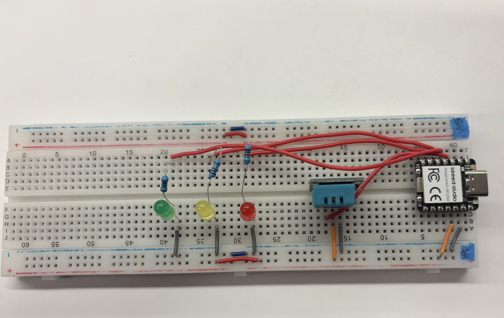
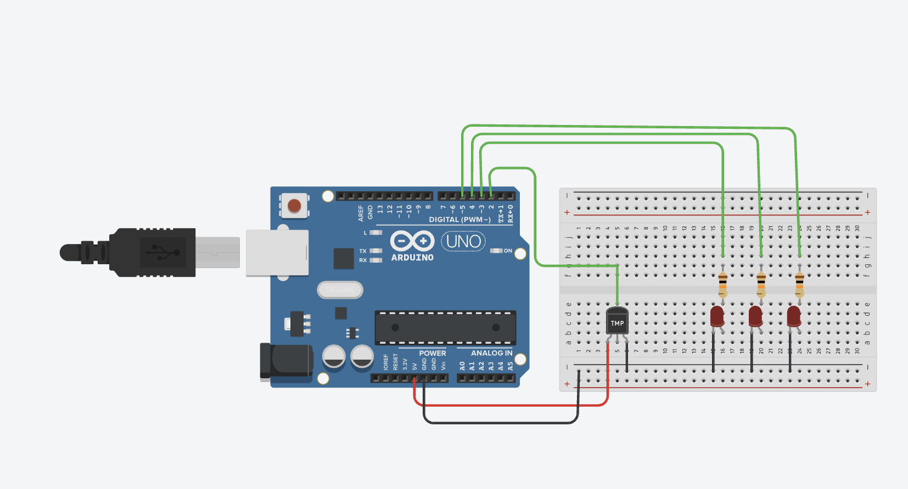
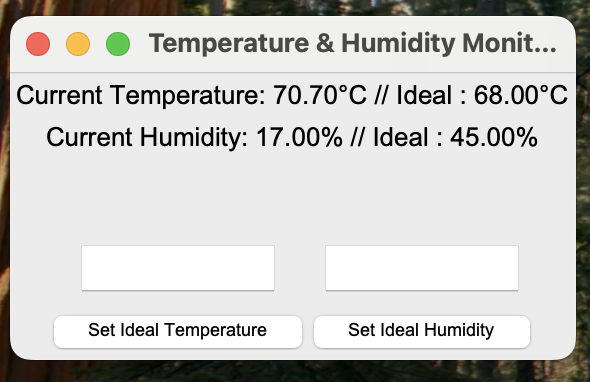

# HCI - ENG : Challange #2

For challange #2 I used the DHT11 Temperature and Humidity sensor to create an interactive system that allows the user to set desired temperature and humidity and warns the user using a three LED system when the sensor values of a pre-set range from the target values.

## How to use this system

### Dependencies

The Arduino code for this project [ReadTempAndHumidity.ino](ReadTempAndHumidity.ino) uses the DHT sensor library from Adafruit Industries. In order to run the code, you must install the following libraries :

- DHT Sensor Library: https://github.com/adafruit/DHT-sensor-library
- Adafruit Unified Sensor Lib: https://github.com/adafruit/Adafruit_Sensor

Additionally, the python file [sendToSerial.py](sendToSerial.py) requires the following libraries/packages:

- pyserial
- tkinter

### How to run

First, replicate the following circuit:

**\*Note that in the second image the temperature sensor has different output pins than the DHT11. Plesae ensure you connect the pins of the sensor correctly**

After installing the necessary libraries, connect to your microcontroller (this project uses the XIAO-RP2350), ensure your port is set correctly, and run [ReadTempAndHumidity.ino](ReadTempAndHumidity.ino). At this point the lighting system should be running with the preset values in [ReadTempAndHumidity.ino](ReadTempAndHumidity.ino).

Next, you can run the python code [sendToSerial.py](sendToSerial.py), which will launch the GUI and allow you to send new target temperatures and humidities and see numerical values for the current temperature and humidity. If successful, you should see this GUI appear:

Finally, input your ideal values and enjoy your room temperature and humidity check system!
